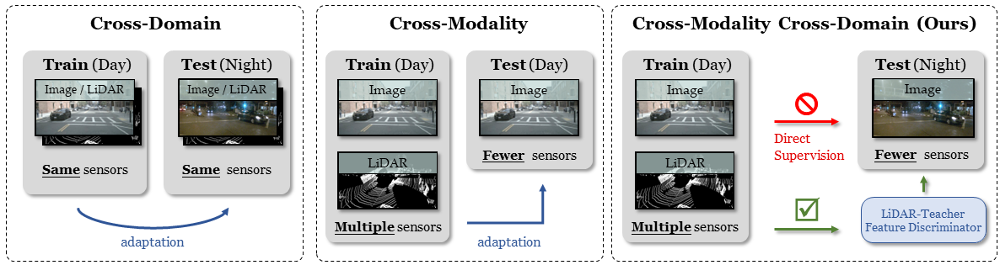
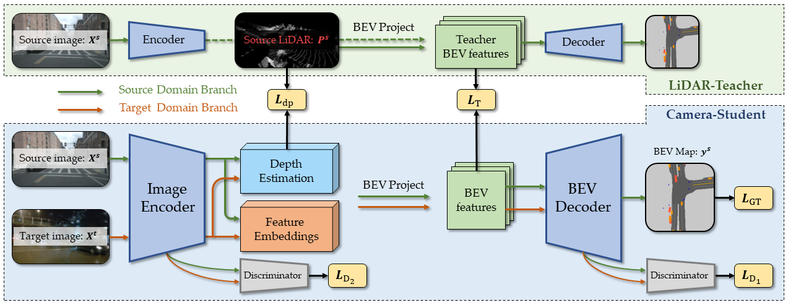

<!-- PROJECT LOGO -->
<br />
<p align="center">

  <h1 align="center">DualCross: Cross-Modality Cross-Domain Adaptation for Monocular BEV Perception </h1>

  <p align="center">
    
  </p>
  <p align="center">
    IROS, 2023
    <br />
    <a href="https://yunzeman.github.io/"><strong>Yunze Man</strong></a>
    ·
    <a href="https://cs.illinois.edu/about/people/department-faculty/lgui"><strong>Liang-Yan Gui</strong></a>
    ·
    <a href="https://yxw.web.illinois.edu/"><strong>Yu-Xiong Wang</strong></a>
    ·
  </p>

  <p align="center">
    <a href='https://arxiv.org/abs/2305.03724'>
      
    </a>
    <a href='https://yunzeman.github.io/DualCross' style='padding-left: 0.5rem;'>
      </a>
    <a href='https://youtu.be/mLqlsVk1HLw' style='padding-left: 0.5rem;'>
      </a>
    <a href='https://github.com/YunzeMan/DualCross' style='padding-left: 0.5rem;'>
      </a>
    <a href="" target='_blank'>
      
    </a>

  </p>
</p>
<br />


This repository contains a pytorch implementation for the paper: [DualCross: Cross-Modality Cross-Domain Adaptation for Monocular BEV Perception](https://arxiv.org/abs/2305.03724). This work results in the first open analysis of cross-domain cross-sensor perception and adaptation for monocular 3D tasks in the wild.<br><br>

## Overview



### Preparation
Clone this repository: 
```Shell
git clone https://github.com/YunzeMan/DualCross
cd DualCross
```

Install requirements in a virtual environment (Tested on anaconda/miniconda environment):

```Shell
conda create --name dualcross --file requirements.txt
```

Download nuscenes data from [https://www.nuscenes.org/](https://www.nuscenes.org/). Install dependencies.

```
pip install nuscenes-devkit tensorboardX efficientnet_pytorch==0.7.0
```

The code is tested on Python `3.6.10` with Pytorch `1.5.0+cu102` and `1.7.0+cu110`.

### Train a Model
To train the LiDAR-Teacher model first
```Python
python main.py train  --logdir=./runs-lteacher  --dataroot=/directory/to/dataset  --bsz=8  --gpuid=0  --domain_gap=True  --source='day'  --target='night'  --parser_name='lidarinputdata'  --up_scale=4  --color_jitter=True  --rand_resize=False  --teacher_student=True  --adv_training=False
```
To train the Image-Student model
```Python
python main.py train  --logdir=./runs-istudent  --dataroot=/directory/to/dataset  --bsz=4  --gpuid=0  --domain_gap=True  --source='day'  --target='night'  --parser_name='imglidardata'  --up_scale=4  --color_jitter=True --rand_resize=False  --adv_training=True  --align_place='midfinal'  --domainloss_lambda=0.1  --middomain_weight=0.1  --teacher_student=True  --train_student=True  --modelf_teacher=/directory/to/trained/teacher/model  --teacher_lambda=1.0  --use_gt=True  --gt_lambda=0.1  --use_depth=True  --depth_lambda=0.05
```

### Visualize Results
```Python
python main.py viz_model_preds --domain_gap=True --source='day' --target='night' --gpuid=1  --nsweeps=1  --up_scale=4  --bsz=1  --version='trainval'  --modelf=/directory/to/trained/model  --parser_name='vizdata'  --viz_gt=False  --viz_depth=True  --mask_2d=True --sep_dpft=False  --strict_import=True  --adv_training=True  --align_midfin=True
```

### Make Videos
```Python
python main.py make_video  --vis_folder='./visualization'  --vtype='tags'  --start_frame=0 --end_frame=150
```

### A More Detailed Doc is Coming Soon

### Demo
A comparison between Cross-domain Adaptation (Left) and DualCross (Right) on day -> night scenario.


## Citation

If you find our work useful in your research, please cite:

```BiBTeX
@inproceedings{man2023dualcross,
  title={{DualCross: Cross-Modality Cross-Domain Adaptation for Monocular BEV Perception}},
  author={Man, Yunze and Gui, Liang-Yan and Wang, Yu-Xiong},
  booktitle={2023 IEEE/RSJ International Conference on Intelligent Robots and Systems (IROS)},
  year={2023}
}
```

## Acknowledgements
This repo is built based on the fantastic work [Lift-Splat-Shoot](https://github.com/nv-tlabs/lift-splat-shoot) by Jonah Philion and Sanja Fidler.